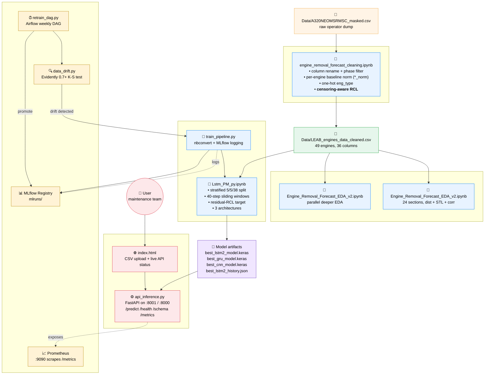
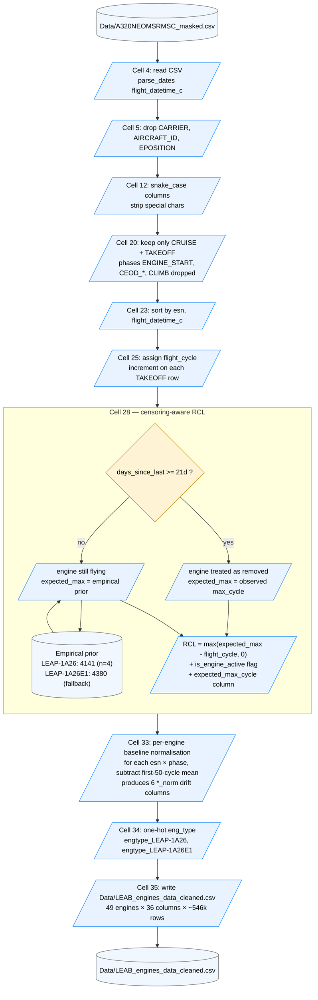
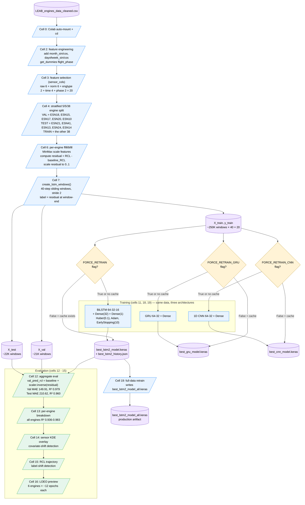
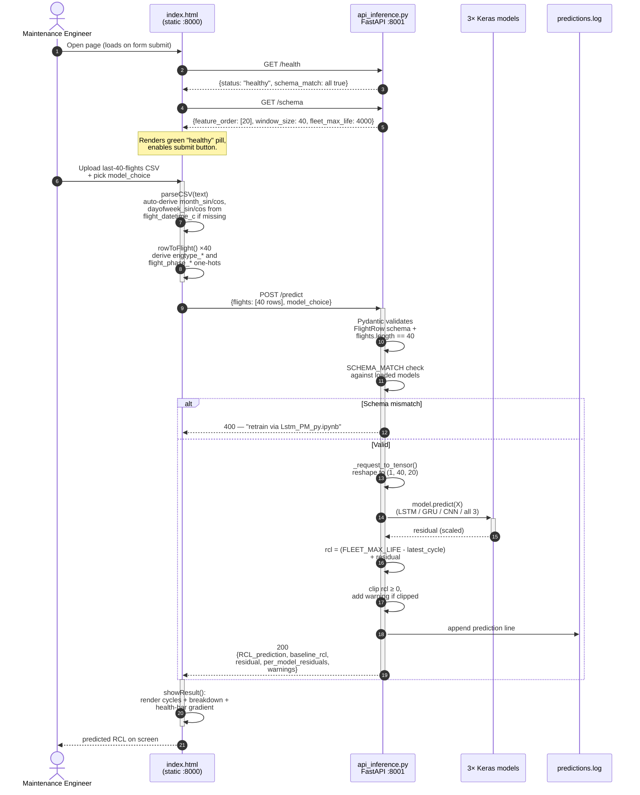
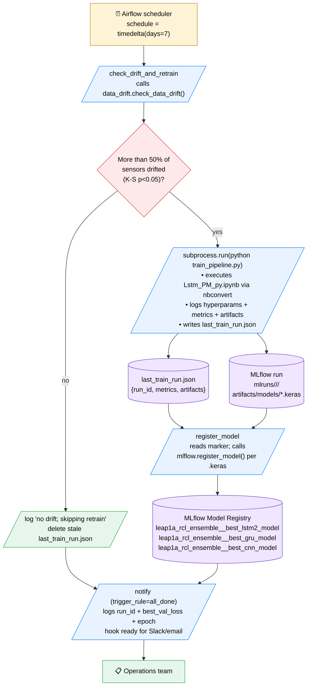
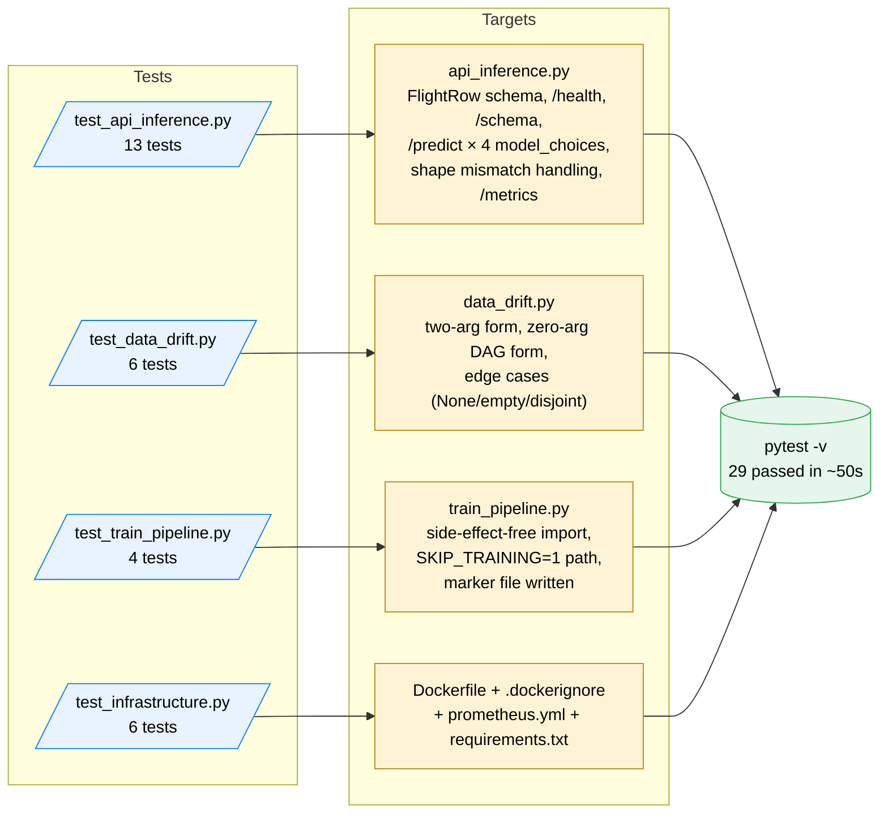

# A320neo Engine RCL Forecast — System Flowcharts

Six diagrams covering every layer of the pipeline. All rendered with Mermaid;
view in GitHub, VS Code (Mermaid Preview extension), or any modern markdown viewer.

1. [System Overview](#1-system-overview)
2. [Data Cleaning Pipeline](#2-data-cleaning-pipeline)
3. [Model Training Pipeline](#3-model-training-pipeline)
4. [Inference Request Lifecycle](#4-inference-request-lifecycle)
5. [Retrain DAG (Airflow + Drift Gate)](#5-retrain-dag-airflow--drift-gate)
6. [Test Suite Coverage](#6-test-suite-coverage)

---

## 1. System Overview

End-to-end view: where data flows, where models are trained, where they're served, and how MLOps monitors and retrains them.

**Legend:**
- 🟧 raw data
- 🟩 cleaned canonical data
- 🟦 notebook / Python script
- 🟪 model artifact
- 🟥 user-facing service
- 🟨 MLOps component

---

## 2. Data Cleaning Pipeline

Inside `engine_removal_forecast_cleaning.ipynb`. The big new piece is the **censoring-aware RCL** in cell 28 — without it the model labels were systematically wrong by 1,000-3,000 cycles for the 43 engines still actively flying.

---Three pending plumbing items

## 3. Model Training Pipeline

Inside `Lstm_PM_py.ipynb`. Three architectures train on the same data and split, each cached to its own `.keras` file. The residual-RCL target is the key trick that prevents the model from short-circuiting via `flight_cycle`.

---

## 4. Inference Request Lifecycle

What happens when a maintenance engineer uploads a CSV through the frontend.

---

## 5. Retrain DAG (Airflow + Drift Gate)

The weekly retrain pipeline. Runs `data_drift.check_data_drift()` first; only retrains when drift is detected.

---

## 6. Test Suite Coverage

29 tests across 4 files, all passing in 45-60 seconds. Each layer has its own test file matching its responsibility.

---

## How to view these diagrams

| Tool | What you do |
|---|---|
| **GitHub** | Push the file to a repo. Mermaid renders inline in the rendered markdown view. |
| **VS Code** | Install the [Markdown Preview Mermaid Support](https://marketplace.visualstudio.com/items?itemName=bierner.markdown-mermaid) extension, then open the preview pane. |
| **JupyterLab** | The built-in markdown renderer (3.0+) supports Mermaid out of the box. |
| **Browser export** | `npx @mermaid-js/mermaid-cli -i FLOWCHARTS.md -o flowcharts.pdf` produces a single PDF. |
| **Standalone images** | Each `mermaid` block can be exported individually via [mermaid.live](https://mermaid.live) — paste, screenshot, save as PNG/SVG. |
